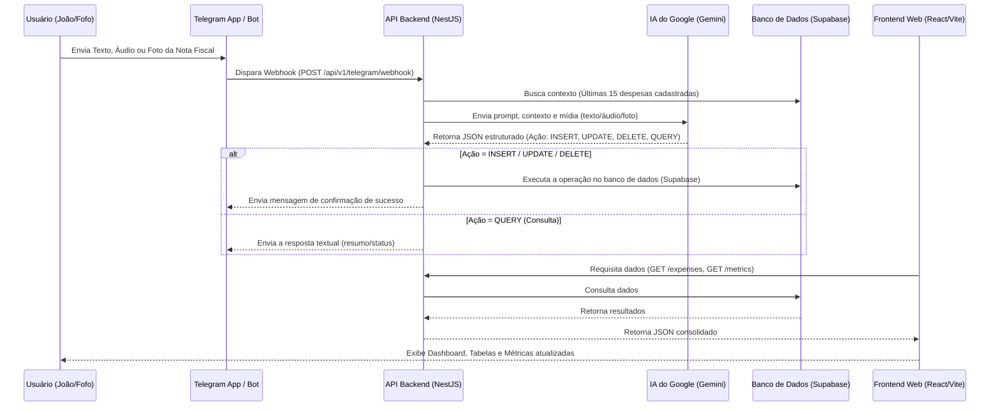

# Arquitetura do Sistema: Gestão Financeira Reforma Chácara

Este documento descreve detalhadamente a arquitetura do sistema, o fluxo de informações, os serviços utilizados e como cada parte se conecta, desde o envio de uma mensagem no Telegram até a exibição no painel web (Frontend).

## 1. Desenho da Arquitetura (Fluxo de Dados)

---

## 2. O Telegram e o BotFather

### O que é o BotFather?
O **BotFather** é o bot oficial do Telegram responsável por criar e gerenciar todos os outros bots na plataforma. Foi lá que você precisou:
1. Enviar o comando `/newbot` para criar o seu assistente.
2. Definir um nome e um *username* (terminado em `bot`).
3. Obter o **Token de Acesso** (ex: `8967675072:AAHyaQNolhhPnb...`). É esse token que o nosso Backend usa para se autenticar e conseguir ler/enviar mensagens em nome do bot.

### O que eu converso no Telegram?
No Telegram, você interage de forma totalmente natural (texto livre, áudios ou fotos de recibos). O bot aceita os seguintes tipos de interação:
- **Cadastro (INSERT):** `"Comprei 5 sacos de areia por 80 reais pago pelo Joao"`, ou enviar a foto de um cupom fiscal, ou gravar um áudio dizendo que pagou o pedreiro.
- **Consulta (QUERY):** `"Quanto já gastamos até agora?"`, `"Quanto o Fofo pagou?"`, `"Quais gastos estão pendentes?"`.
- **Edição (UPDATE):** `"Altera o valor das latas de tinta para 180 reais pago 50/50"`.
- **Exclusão (DELETE):** `"Exclui o último gasto"` ou `"Apaga a linha do cimento"`.

### O Webhook do Telegram
Para que o seu Backend (NestJS) saiba instantaneamente que você mandou uma mensagem no Telegram, configuramos um **Webhook**. 
Em vez do Backend ficar perguntando ao Telegram "tem mensagem nova?", o próprio Telegram faz uma requisição HTTP (`POST /api/v1/telegram/webhook`) para o seu servidor sempre que alguém fala com o bot. 
- *Segurança:* Usamos um `X-Telegram-Bot-Api-Secret-Token` (configurado nas variáveis de ambiente) para garantir que apenas o Telegram verdadeiro consiga chamar essa rota.

---

## 3. O Backend (NestJS) e Suas Rotas

O Backend é o cérebro da operação. Ele é construído em **Node.js com o framework NestJS**. Ele possui rotas que servem o Frontend e rotas que servem o Telegram.

### Rotas de Despesas (`/api/v1/expenses`)
Rotas consumidas principalmente pelo **Frontend**:
- `GET /api/v1/expenses`: Lista todas as despesas com paginação, busca e filtros (por categoria, status, responsável, etc.).
- `GET /api/v1/expenses/:id`: Retorna os dados de uma despesa específica.
- `POST /api/v1/expenses`: Cria uma despesa manualmente (usado quando você cadastra algo diretamente pelo site).
- `PATCH /api/v1/expenses/:id`: Atualiza parte de uma despesa.
- `DELETE /api/v1/expenses/:id`: Exclui uma despesa específica.
- `GET /api/v1/expenses/metrics`: Rota super importante. Ela consolida em tempo real o total gasto, quanto João pagou, quanto Fofo pagou, quanto está pendente, e calcula exatamente o **Acerto de Contas (quem deve quanto a quem)**.

### Rota do Telegram (`/api/v1/telegram/webhook`)
Rota consumida pelo **Telegram**:
- `POST /api/v1/telegram/webhook`: Recebe os dados brutos da mensagem do usuário (texto, id do áudio, ou id da foto), faz o download da mídia se necessário, anexa o contexto do banco de dados, e envia tudo para a Inteligência Artificial do Google Gemini. Após a IA responder, o backend decide se deve salvar no banco, deletar, ou apenas mandar uma resposta de texto de volta pro chat.

---

## 4. A Comunicação com a IA do Gemini

Para interpretar as mensagens de áudio, texto bagunçado e fotos de notas fiscais, usamos a API do Google Gemini.

### Modelos Utilizados
A API está configurada para tentar os seguintes modelos (do mais rápido/esperto para o fallback):
1. **`gemini-2.5-flash`**: O modelo principal, muito rápido, multimodal (lê imagens e áudio nativamente) e excelente para raciocínio lógico estruturado.
2. **`gemini-2.5-flash-lite`** / **`gemini-3-flash-preview`**: Modelos de fallback caso o principal sofra instabilidade ou rate limit.

### Custos: É grátis ou não?
- **Camada Gratuita do Gemini (AI Studio):** O Google oferece uma cota gratuita bastante generosa para os modelos Flash (geralmente até 15 RPM - Requisições Por Minuto - e 1 milhão de tokens por minuto). Para o uso pessoal de controle financeiro da chácara, **você não deve pagar nada** pelo uso do Gemini, contanto que use a chave de API gratuita do Google AI Studio e não ultrapasse os limites de uso abusivo diários. 
- *Aviso:* A camada gratuita pode usar os seus prompts para treinar o modelo do Google. Como se trata de controle financeiro pessoal, geralmente não há problemas, mas é um detalhe de privacidade a se ter em mente.

### Como a IA interage com o Chat
A IA não responde o usuário diretamente. Ela responde ao *Backend* em formato **JSON**. O Backend pega esse JSON e toma uma atitude. Por exemplo: se a IA entender que é um novo cadastro, ela devolve o JSON indicando `action: INSERT` e o valor extraído da nota fiscal. O Backend salva no banco (Supabase) e então manda uma mensagem ao usuário no Telegram dizendo: `"✅ Gasto registrado com sucesso!"`.

---

## 5. O Frontend Web (React + Vite)

O Frontend é a interface visual administrativa (painel de controle) do sistema, construído com **React 19, TypeScript e Tailwind CSS**. 

### O que tem no Frontend?
- **Métricas em Tempo Real (Top Cards):** Mostra instantaneamente o custo total da obra, quanto João e Fofo já pagaram do próprio bolso, o total de boletos/pendências em aberto, e o cartão de **Acerto de Contas** (ex: *João deve R$ 249,50 para Fofo*).
- **Filtros (FilterBar):** Uma barra superior para buscar rapidamente uma despesa pelo nome, ou filtrar por Categoria (Mão de Obra, Material), Status (Pago/Pendente) e Responsável (João/Fofo/Ambos).
- **Tabela de Despesas:** Listagem completa com paginação e ordenação, contendo badges coloridos indicando o status do pagamento.
- **Formulário de Cadastro/Edição:** Um modal que permite cadastrar gastos manualmente. O grande diferencial aqui são os **botões rápidos de rateio**: com um clique você preenche "100% João", "100% Fofo", "50/50 Meio a Meio", ou "Deixar Pendente".

### Sincronia entre Frontend e Telegram
Se você enviar uma foto de nota fiscal pro Telegram, o Backend salvará no Supabase. A próxima vez que você abrir ou recarregar a página do Frontend, a nova despesa já estará lá, e os cálculos de "Quem deve a quem" estarão atualizados automaticamente, sem que você precise digitar um único número no sistema web.
